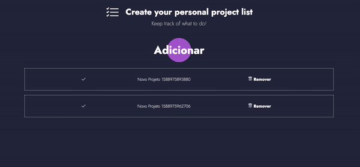

<h1 align="center">Segundo desafio do Bootcamp da Rocketseat</h1>
<p>
  
  <a href="#" target="_blank">
    
  </a>
</p>
<center>
  
</center>
## :rocket: Sobre o desafio

Essa é uma aplicação frontend para armarzenar os repositórios do backend construído com NodeJS. Essa aplicação foi criada com o uso do Framework ReactJS.

## Funcionalidades

- Listar os repositórios da sua API: Deve ser capaz de criar uma lista com o campo title de todos os repositórios que estão cadastrados na sua API.

- Adicionar um repositório a sua API: Deve ser capaz de adicionar um novo item na sua API através de um botão com o texto Adicionar e, após a criação, deve ser capaz de exibir o nome dele após o cadastro.

- Remover um repositório da sua API: Para cada item da sua lista, deve possuir um botão com o texto Remover que, ao clicar, irá chamar uma função para remover esse item da lista do seu frontend e da sua API.

## Instalação

```sh
git clone https://github.com/Dadarkp3/Desafio-Conceitos-do-ReactJS.git
cd Desafio-Conceitos-do-ReactJS
yarn
```

## Iniciando a aplicação localmente:

Para iniciar a aplicação localmente você precisa
Abrir a sua aplicação na pasta root e usar o comando:

```
yarn start
```

Agora você pode acessar a aplicação localmente por `http://localhost:3000`.

---

## Autor

:woman: **Daiane Silva**
